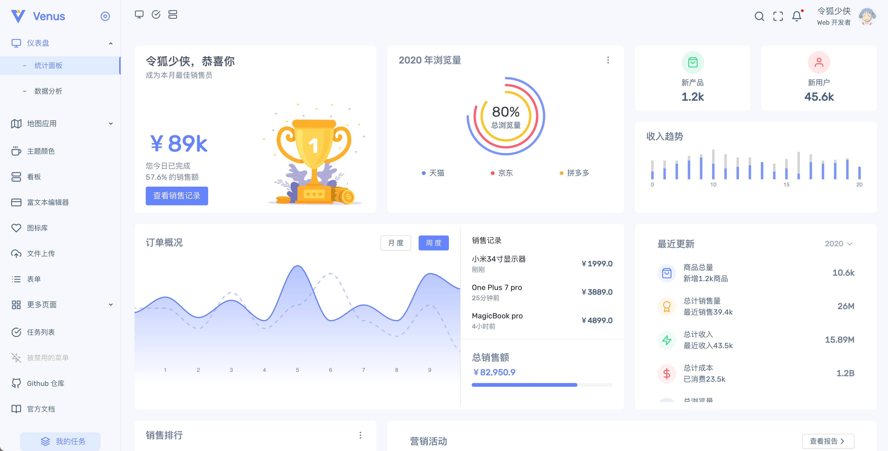
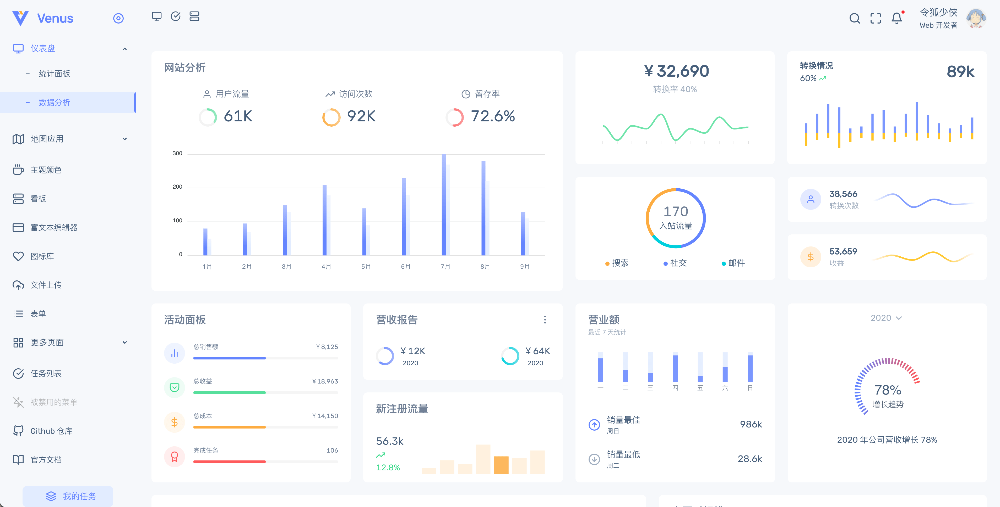

  

<h1 align="center">Venus Admin</h1>

## 界面一览

## 介绍

Venus 是由 Vue.js 驱动的中后台系统模板，凝聚了许多常用功能的具体实现，优秀的设计语言和高质量的代码绝对能让你眼前一亮。

## 在线预览

https://venus.leoku.top/ [GitHub Pages]

## 文档地址

https://docs.leoku.top/ [GitHub Pages]

## License

